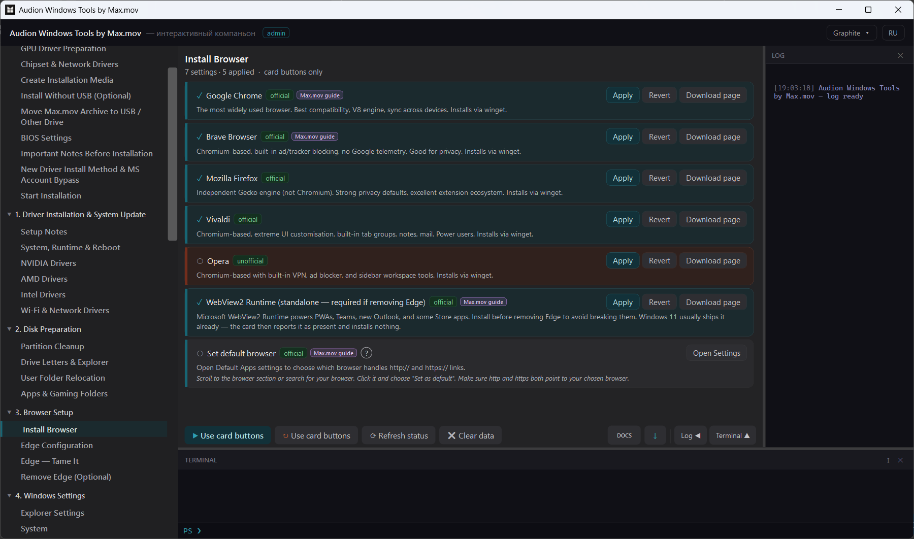

# Audion Windows Tools by Max.mov

<!-- audion:release -->

  
  
  
  

**Version 1.11.2** · 2026-09-02 · 131.0 MB

- [Direct download](https://audion.dev/get/windows-tools-by-max.mov/1.11.2/Audion_Windows_Tools_by_Max.mov_v1.11.2_Full.zip) — unmetered, no rate limits
- [Project page](https://audion.dev/downloads/windows-tools-by-max.mov) — every version and how to install

`SHA-256: 3186d2a75ee9b0355e18a61fc812e1dd471e80be50a04c78c93ad62ae1bed309`

---

An **Audion** tool, published by [Tensionix](https://github.com/Tensionix).
<!-- /audion:release -->

[Русский](README_RU.md) · [User Guide](USER_GUIDE_EN.md)

An interactive companion to a large Windows configuration guide — and a
standalone assistant for preparing a workstation.

## Why It Exists

There is a detailed Windows configuration guide running to seven hours of video.
Going through it takes a weekend, and half the steps are forgotten halfway: where
that settings page was, what exactly to change there, how to put it back.

This program does not retell the guide line by line. It takes the familiar
sequence and adds what video cannot: **states, rollback, automation**, and
practical scenarios of its own.

## The Central Decision

**The program does not apply tweaks automatically.**

It organises verified actions, opens the relevant Windows sections and external
utilities, performs what it can perform, and shows what the operator must check
personally.

A non-specialist can follow the route through the cards without hunting for each
system page by hand. But **reading the description before pressing is required of
everyone**.

## Next

* [User Guide](USER_GUIDE_EN.md) — the route by section.
